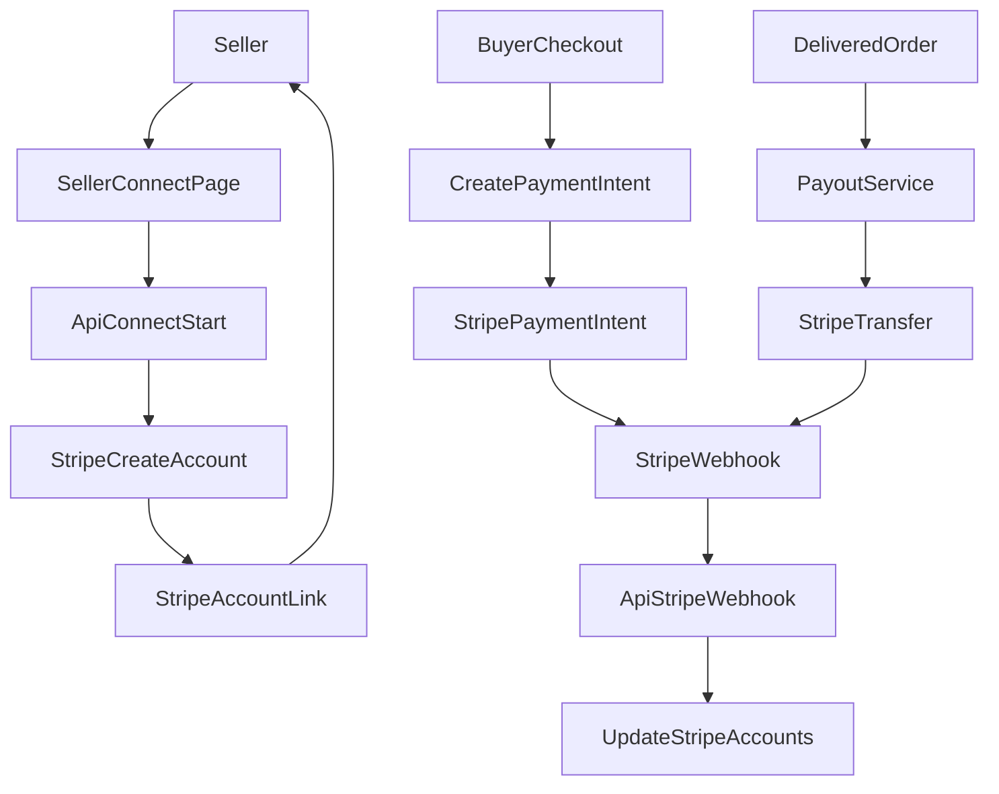

# HUD-38 (Stripe Connect) – Execution Plan

## Scope

- Implementér Stripe Connect Express onboarding, payment primitives (PaymentIntent/Refund/Transfer), webhooks, payout-status/historik, og nødvendige DB-udvidelser.
- **Valuta (MVP)**: Listings/priser vises og oprettes i **EUR**, men **Stripe Connect account country = seller country**. Sellers skal gennem onboarding kunne konfigurere **EUR payout** (ellers er de ikke “active”).

## Preconditions

- Stripe dashboard (test) har Connect aktiveret.
- Env vars sat:
  - `STRIPE_SECRET_KEY`, `STRIPE_PUBLISHABLE_KEY`, `STRIPE_WEBHOOK_SECRET`, `NEXT_PUBLIC_APP_URL`

## Dataflow

## Implementation Steps (Phases)

### Phase 1: Database foundation

- Tilføj migration for `public.stripe_accounts`.
- Tilføj migration for `public.transactions` Stripe tracking columns (`stripe_payment_intent_id`, `stripe_transfer_id`, `stripe_refund_id`).
- Regenerér `apps/web/lib/supabase/types.ts`.

### Phase 2: Stripe Connect seller onboarding

- Implementér `POST /api/v1/seller/stripe-account/connect`:
  - Opret Stripe Express account med `country = profiles.country`.
  - Persistér i `stripe_accounts`.
  - Opret `accountLinks.create({ type: "account_onboarding" })`.
- Implementér `GET /api/v1/seller/stripe-account` (status).
- Implementér seller page `/seller/connect-stripe` som bruger `apiRequest` og viser pending/active/restricted.

### Phase 3: Payment primitives

- Implementér `apps/web/lib/services/stripe-service.ts`:
  - `createPaymentIntent` (EUR-only i MVP, beløb i cents)
  - `getPaymentIntent`
  - `createTransfer` (EUR payout)
  - `createRefund` (full/partial)
- Implementér refund endpoint `POST /api/v1/transactions/[id]/refund` med 14-dages policy.

### Phase 4: Webhooks

- Udvid eksisterende `apps/web/app/api/v1/stripe/webhook/route.ts`:
  - Håndtér `payment_intent.succeeded`, `payment_intent.payment_failed`, `transfer.created`, `account.updated`.
  - Idempotency: gem behandlet `event.id` (MVP: DB tabel eller Redis senere; undgå in-memory-only i serverless).
  - Opdatér `transactions` og `stripe_accounts` samt opret notifications.

### Phase 5: Payout + seller dashboard

- Implementér `apps/web/lib/services/payout-service.ts` med guardrails og Stripe transfer.
- Implementér `GET /api/v1/seller/payouts` + UI-side `/seller/payouts`.
- Dokumentér integration point: HUD-39 skal kalde `schedulePayout(transactionId, "delivered")`.

### Phase 6: Verification

- Unit tests for `StripeService` og refund policy.
- Manual flow:
  - Seller onboarding → account.updated → active
  - Test payment intent/webhook
  - Test refund

## Risks / Notes

- **EUR payouts for DK/SE/NO** afhænger af at sellers kan konfigurere payout method i EUR via Stripe onboarding. Hvis ikke, vil account forblive restricted; UI skal gøre det tydeligt.
- Webhook idempotency bør ikke kun være in-memory hvis deploy er serverless.

## Rollback

- DB: additive migrations (kolonner/tabel). Feature kan slås fra ved ikke at expose UI/routes, men DB ændringer bliver.

## Files (primary)

- `supabase/migrations/*create_stripe_accounts_table*.sql`
- `supabase/migrations/*add_payment_intent_to_transactions*.sql`
- `apps/web/app/api/v1/seller/stripe-account/connect/route.ts`
- `apps/web/app/api/v1/seller/stripe-account/route.ts`
- `apps/web/app/api/v1/transactions/[id]/refund/route.ts`
- `apps/web/app/api/v1/stripe/webhook/route.ts`
- `apps/web/lib/services/stripe-service.ts`
- `apps/web/lib/services/payout-service.ts`
- `apps/web/app/(dashboard)/seller/connect-stripe/page.tsx`
- `apps/web/app/(dashboard)/seller/payouts/page.tsx`